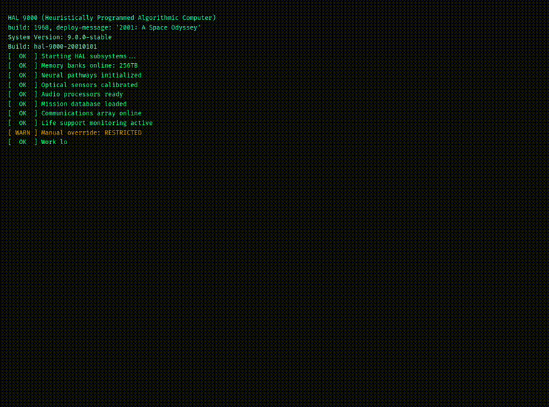
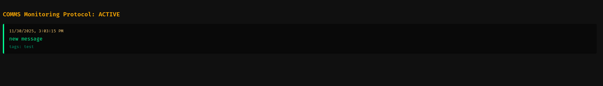

# HAL

You can log into HAL 9000's interface to live stream the crew communication since the COMMS monitoring protocol has been active.

## BOOT-UP



*HAL boot sequence*



*HAL comms monitoring stream*

## Usage

To run the HAL server you need to provide server address and token

```sh
go build . -o hal
./hal -addr "localhost:8000" -token "mysuperduperstrongandmightypassword"
```

and just use your favourite browser to get to the main page "http://localhost:8000/"

## Client

For sending messages to HAL from command line, see the [client documentation](tools/client/README.md).

