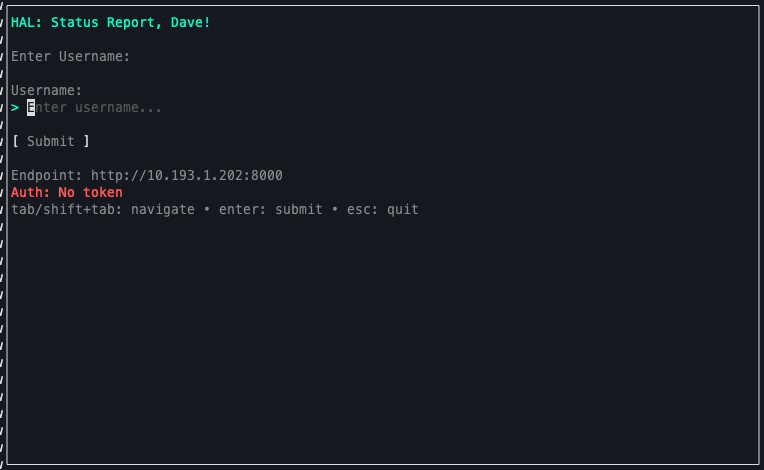
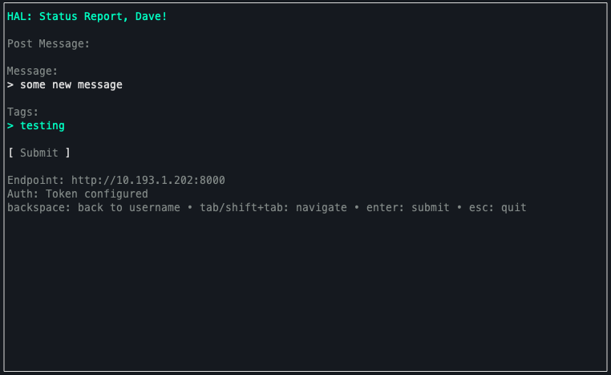

# Client 

Comms client for crew members. 

## Usage

### Build the client

```zsh
go build
```

### Run the client

```zsh
# Run with default settings (localhost:8080)
./h_comms

# Run with custom server address
./h_comms -addr localhost:8000
```

## How it works

Just run, it's simple enough that you will get the hang of it.

> Tokens are saved in `~/.hal/tokens/<USERNAME>.token`.


### First Screen:




### Second Screen:



